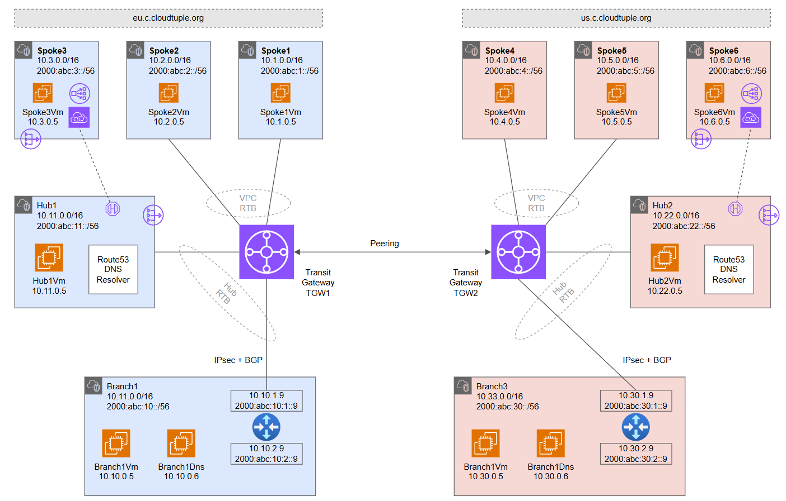

# Virtual WAN - Dual Region <!-- omit from toc -->

## Lab: Vwan22 <!-- omit from toc -->

Contents

- [Overview](#overview)
- [Prerequisites](#prerequisites)
- [Deploy the Lab](#deploy-the-lab)
- [Troubleshooting](#troubleshooting)
- [Outputs](#outputs)
- [Dashboards (Optional)](#dashboards-optional)
- [Testing](#testing)
  - [1. Ping IP](#1-ping-ip)
  - [2. Curl DNS](#2-curl-dns)
  - [3. Private Link Service](#3-private-link-service)
  - [4. Private Link Access to S3](#4-private-link-access-to-s3)
  - [5. Private Link Access to S3 from On-premises](#5-private-link-access-to-s3-from-on-premises)
  - [6. Transit Gateway Routes](#6-transit-gateway-routes)
  - [8. On-premises Routes](#8-on-premises-routes)
- [Cleanup](#cleanup)
- [Requirements](#requirements)
- [Inputs](#inputs)
- [Outputs](#outputs-1)

## Overview

This lab deploys a dual-region transit gateway hub and spoke topology. The lab demonstrates multi-region traffic routing patterns, [hybrid DNS](https://docs.aws.amazon.com/prescriptive-guidance/latest/patterns/set-up-dns-resolution-for-hybrid-networks-in-a-single-account-aws-environment.html) resolution, and [PrivateLink](https://docs.aws.amazon.com/vpc/latest/userguide/endpoint-services-overview.html) access to IaaS and PaaS services.


<p>

The Virtual Private Cloud (VPC) networks, ***hub1*** and ***hub2***, are central hub networks that host shared services for all spokes in a region. Shared services include private DNS, firewall, tooling and other resources. ***hub1*** and ***hub2*** connect to their respective transit gateways, ***tgw1*** and ***tgw2***.

***Spoke1*** and ***spoke2*** connect to ***tgw1*** using [transit gateway VPC attachments](https://docs.aws.amazon.com/vpc/latest/tgw/tgw-vpc-attachments.html). Similarly, ***Spoke4*** and ***spoke5*** connect to ***tgw2*** using attachments. ***Spoke3*** and ***spoke6*** are not connected to the transit gateways but are reachable via [PrivateLink endpoints](https://docs.aws.amazon.com/vpc/latest/privatelink/concepts.html#concepts-vpc-endpoints) in the hubs.


***Branch1*** and ***branch3*** are on-premises networks simulated using VPCs. Multi-NIC Linux NVA appliances connect to the transit gateways using IPsec VPN connections with dynamic (BGP) routing. The branches connect to each other via inter-regional transit gateway peering.

## Prerequisites

Ensure you meet all requirements in the [prerequisites](../../prerequisites/README.md) before proceeding.

## Deploy the Lab

1. Clone the Git Repository for the Labs

   ```sh
   git clone https://github.com/kaysalawu/aws-network-terraform.git
   ```

2. Navigate to the lab directory

   ```sh
   cd aws-network-terraform/3-labs/b-dual-region
   ```
3. (Optional) If you want to enable additional features such as IPv6, VPC flow logs and logging set the following variables to `true` in the [`02-main.tf`](./02-main.tf) file.

   | Variable | Description | Default | Link |
   |----------|-------------|---------|------|
   | enable_dashboards | Configure dashboards for enabled resources | false | [02-main.tf#L09](./02-main.tf#L09) |
   | enable_ipv6 | Enable IPv6 on all supported resources | false | [02-main.tf#L10](./02-main.tf#L10) |
   | enable_flow_logs | Enable VPC flow logs in the VPC hubs | false | [02-main.tf#L11](./02-main.tf#L11) |
   ||||
4. Run the following terraform commands and type ***yes*** at the prompt:

   ```sh
   terraform init
   terraform plan
   terraform apply -parallelism=50
   ```

## Troubleshooting

See the [troubleshooting](../../troubleshooting/README.md) section for tips on how to resolve common issues that may occur during the deployment of the lab.

## Outputs

The table below shows the auto-generated output files from the lab. They are located in the `output` directory.

| Item    | Description  | Location |
|--------|--------|--------|
| Branch1 DNS | Authoritative DNS and forwarding | [output/branch1Dns.sh](./output/branch1-dns.sh) |
| Branch3 DNS | Authoritative DNS and forwarding | [output/branch3Dns.sh](./output/branch3-dns.sh) |
| Branch1 NVA | Linux Strongswan + FRR configuration | [output/branch1Nva.sh](./output/branch1-nva.sh) |
| Branch3 NVA | Linux Strongswan + FRR configuration | [output/branch3Nva.sh](./output/branch3-nva.sh) |
| VM server | Python Flask web server, test scripts | [output/server.sh](./output/server.sh) |
| VM cloud-init YAML | Python Flask web server, test scripts | [output/vm-cloud-config.yml](./output/vm-cloud-config.yml) |
||||

## Dashboards (Optional)

This lab contains a number of pre-configured dashboards for monitoring gateways, VPN gateways, firewall and other resources. To deploy the dashboards, set `enable_dashboards = true` in the [02-main.tf#L09](./02-main.tf#L09) file. Then run `terraform apply` to update the deployment.

<details>

<summary>Sample Dashboards</summary>

To view the dashboards, follow the steps below:

1. From the AWS console menu, select....

2. TBC.

3. TBC.

4. TBC.

Sample dashboard for transit gateway ***tgw1***.


</details>
<p>

## Testing

Each EC2 instance is pre-configured with a shell [startup script](../../scripts/startup.sh) to run various types of network reachability tests.

You can [enable serial console access](https://docs.aws.amazon.com/AWSEC2/latest/UserGuide/configure-access-to-serial-console.html#serial-console-account-access) for all regions in order to connect to EC2 instances via the serial console. Alternatively, you can set up SSH key-pair access to the EC2 instances as described in the [prerequisites](../../prerequisites/README.md#6-ssh-access-to-virtual-machines-optional).

- Login to EC2 instance `b-spoke1-vm` via the [serial console](https://docs.aws.amazon.com/AWSEC2/latest/UserGuide/connect-to-serial-console.html)
- Enter the login credentials
  - username = ***ubuntu***
  - password = ***Password123***
- You should now be in a shell session `b-spoke1-vm:~$`

</details>
<p>

Run the following tests from inside the serial console session.

### 1. Ping IP

This script pings the IP addresses of some test EC2 instances and reports reachability and round trip time.

**1.1.** Run the IP ping tests

```sh
ping-ipv4
```

<details>

<summary>Sample output</summary>

```sh
b-spoke1-vm:~$ ping-ipv4

 ping ipv4 ...

branch1 - 10.10.0.5 - OK 2.490 ms
hub1  - 10.11.0.5 - OK 0.649 ms
spoke1  - 10.1.0.5 - OK 0.042 ms
spoke2  - 10.2.0.5 - OK 0.522 ms
branch3 - 10.30.0.5 - OK 81.787 ms
hub2  - 10.22.0.5 - OK 81.088 ms
spoke4  - 10.4.0.5 - OK 82.265 ms
spoke5  - 10.5.0.5 - OK 80.889 ms
```

</details>
<p>

### 2. Curl DNS

This script uses curl to check reachability of web server (python Flask) on the test EC2 instances. It reports HTTP response message, round trip time and IP address.

**3.1.** Run the DNS curl test

```sh
curl-dns4
```

<details>

<summary>Sample output</summary>

```sh
b-spoke1-vm:~$ curl-dns4

 curl dns ipv4 ...

200 (0.021215s) - 10.10.0.5 - branch1Vm.cloudtuple.org
200 (0.021545s) - 10.11.0.5 - hub1Vm.eu.c.cloudtuple.org
200 (0.010880s) - 10.1.0.5 - spoke1Vm.eu.c.cloudtuple.org
200 (0.013120s) - 10.2.0.5 - spoke2Vm.eu.c.cloudtuple.org
200 (0.175742s) - 10.30.0.5 - branch3Vm.cloudtuple.org
200 (0.174920s) - 10.22.0.5 - hub2Vm.us.c.cloudtuple.org
200 (0.173508s) - 10.4.0.5 - spoke4Vm.us.c.cloudtuple.org
200 (0.180157s) - 10.5.0.5 - spoke5Vm.us.c.cloudtuple.org
200 (0.018312s) - 104.16.185.241 - icanhazip.com
```

</details>
<p>

### 3. Private Link Service

**3.1.** Test access to ***spoke3*** web application using the private endpoint in ***hub1***.

```sh
curl spoke3pl.eu.c.cloudtuple.org
```

<details>

<summary>Sample output</summary>

```json

```

</details>
<p>

**3.2.** Test access to ***spoke6*** web application using the private endpoint in ***hub2***.

```sh
curl spoke6pl.us.c.cloudtuple.org
```

<details>

<summary>Sample output</summary>

```sh
azureuser@spoke1Vm:~$ curl spoke6pl.us.c.cloudtuple.org
{
  "app": "SERVER",
  "hostname": "spoke6Vm",
  "server-ipv4": "10.6.0.5",
  "server-ipv6": "NotFound",
  "remote-addr": "10.6.6.4",
  "headers": {
    "host": "spoke6pl.us.c.cloudtuple.org",
    "user-agent": "curl/7.68.0",
    "accept": "*/*"
  }
}
```

</details>
<p>

The `Hostname`, `server-ipv4` and `server-ipv6` fields identifies the actual web servers - in this case ***spoke3*** and ***spoke6*** EC2 instances. The `remote-addr` fields (as seen by the web servers) are IP addresses in the Private Link Service NAT subnets in ***spoke3*** and ***spoke6*** respectively.

### 4. Private Link Access to S3

Storage accounts with container blobs are deployed and accessible via private endpoints in ***hub1*** and ***hub2*** respectively. The storage accounts have the following naming convention:

* vwan22spoke3sa\<AAAA\>.blob.core.windows.net
* vwan22spoke6sa\<BBBB\>.blob.core.windows.net

Where ***\<AAAA\>*** and ***\<BBBB\>*** are randomly generated two-byte strings.

**4.1.** On your Cloudshell (or local machine), get the storage account hostname and blob URL.

```sh
spoke3_storage_account=$(az storage account list -g Vwan22_Vwan_2Region_RG --query "[?contains(name, 'vwan22spoke3sa')].name" -o tsv)

spoke3_sgtacct_host="$spoke3_storage_account.blob.core.windows.net"
spoke3_blob_url="https://$spoke3_sgtacct_host/spoke3/spoke3.txt"

echo -e "\n$spoke3_sgtacct_host\n" && echo
```

<details>

<summary>Sample output</summary>

```sh
vwan22spoke3sa4ee9.blob.core.windows.net
```

</details>
<p>

**4.2.** Resolve the hostname

```sh
nslookup $spoke3_sgtacct_host
```

<details>

<summary>Sample output</summary>

```sh
2-vwan-dual-region$ nslookup $spoke3_sgtacct_host
Server:         127.0.0.53
Address:        127.0.0.53#53

Non-authoritative answer:
vwan22spoke3sa4ee9.blob.core.windows.net        canonical name = vwan22spoke3sa4ee9.privatelink.blob.core.windows.net.
vwan22spoke3sa4ee9.privatelink.blob.core.windows.net    canonical name = blob.db3prdstr16a.store.core.windows.net.
Name:   blob.db3prdstr16a.store.core.windows.net
Address: 20.150.47.132
```

</details>
<p>

We can see that the endpoint is a public IP address, ***20.150.47.132***. We can see the CNAME `vwan22spoke3sa4ee9.privatelink.blob.core.windows.net.` created for the storage account which recursively resolves to the public IP address.

**4.3.** Test access to the storage account blob.

```sh
curl $spoke3_blob_url && echo
```

<details>

<summary>Sample output</summary>

```sh
Hello, World!
```

</details>
<p>

### 5. Private Link Access to S3 from On-premises

**5.1** Login to on-premises EC2 instance `Vwan22-branch1Vm` via the [serial console](https://learn.microsoft.com/en-us/troubleshoot/azure/virtual-machines/serial-console-overview#access-serial-console-for-virtual-machines-via-azure-portal):
  - username = ***azureuser***
  - password = ***Password123***

 We will test access from `Vwan22-branch1Vm` to the storage account for ***spoke3*** via the private endpoint in ***hub1***.

**5.2.** Run `az login` using the VM's system-assigned managed identity.

```sh
az login --identity
```

<details>

<summary>Sample output</summary>

```json
azureuser@branch1Vm:~$ az login --identity
[
  {
    "environmentName": "AzureCloud",
    "homeTenantId": "aaa-bbb-ccc-ddd-eee",
    "id": "xxx-yyy-1234-1234-1234",
    "isDefault": true,
    "managedByTenants": [
      {
        "tenantId": "your-tenant-id"
      }
    ],
    "name": "some-random-name",
    "state": "Enabled",
    "tenantId": "your-tenant-id",
    "user": {
      "assignedIdentityInfo": "MSI",
      "name": "systemAssignedIdentity",
      "type": "servicePrincipal"
    }
  }
]
```

</details>
<p>

**5.3.** Get the storage account hostname and blob URL.

```sh
spoke3_storage_account=$(az storage account list -g Vwan22_Vwan_2Region_RG --query "[?contains(name, 'vwan22spoke3sa')].name" -o tsv)

spoke3_sgtacct_host="$spoke3_storage_account.blob.core.windows.net"
spoke3_blob_url="https://$spoke3_sgtacct_host/spoke3/spoke3.txt"

echo -e "\n$spoke3_sgtacct_host\n" && echo
```

<details>

<summary>Sample output</summary>

```sh
vwan22spoke3sa4ee9.blob.core.windows.net
```

</details>
<p>

**5.4.** Resolve the storage account DNS name

```sh
nslookup $spoke3_sgtacct_host
```

<details>

<summary>Sample output</summary>

```sh
azureuser@branch1Vm:~$ nslookup $spoke3_sgtacct_host
Server:         127.0.0.53
Address:        127.0.0.53#53

Non-authoritative answer:
vwan22spoke3sa4ee9.blob.core.windows.net        canonical name = vwan22spoke3sa4ee9.privatelink.blob.core.windows.net.
Name:   vwan22spoke3sa4ee9.privatelink.blob.core.windows.net
Address: 10.11.7.99
```

</details>
<p>

We can see that the storage account hostname resolves to the private endpoint ***10.11.7.99*** in ***hub1***. The following is a summary of the DNS resolution from `Vwan22-branch1Vm`:

- On-premises server `Vwan22-branch1Vm` makes a DNS request for `vwan22spoke3sa4ee9.blob.core.windows.net`
- The request is received by on-premises DNS server `Vwan22-branch1-dns`
- The DNS server resolves `vwan22spoke3sa4ee9.blob.core.windows.net` to the CNAME `vwan22spoke3sa4ee9.privatelink.blob.core.windows.net`
- The DNS server has a conditional DNS forwarding defined in the branch1 unbound DNS configuration file, [output/branch1Dns.sh](./output/branch1Dns.sh).

  ```sh
  forward-zone:
          name: "privatelink.blob.core.windows.net."
          forward-addr: 10.11.8.4
  ```

  DNS Requests matching `privatelink.blob.core.windows.net` will be forwarded to the private DNS resolver inbound endpoint in ***hub1*** (10.11.8.4).
- The DNS server forwards the DNS request to the private DNS resolver inbound endpoint in ***hub1*** - which returns the IP address of the storage account private endpoint in ***hub1*** (10.11.7.99)

**5.5.** Test access to the storage account blob.

```sh
curl $spoke3_blob_url && echo
```

<details>

<summary>Sample output</summary>

```sh
Hello, World!
```

</details>
<p>

### 6. Transit Gateway Routes

**6.1.** Switch back to the lab directory `aws-network-terraform/3-labs/b-dual-region`

**6.2.** Display the virtual WAN routing table(s)

```sh

```

<details>

<summary>Sample output</summary>

```sh

```

</details>
<p>

### 8. On-premises Routes

**8.1** Login to on-premises EC2 instance `Vwan22-branch1Nva` via the [serial console](https://learn.microsoft.com/en-us/troubleshoot/azure/virtual-machines/serial-console-overview#access-serial-console-for-virtual-machines-via-azure-portal):
  - username = ***azureuser***
  - password = ***Password123***

**8.2.** Enter the VTY shell for the FRRouting daemon.

```sh
sudo vtysh
```

<details>

<summary>Sample output</summary>

```sh
azureuser@branch1Nva:~$ sudo vtysh

Hello, this is FRRouting (version 7.2.1).
Copyright 1996-2005 Kunihiro Ishiguro, et al.
```

</details>
<p>

**8.3.** Display the routing table by typing `show ip route` and pressing the space bar to show the complete output.

```sh
show ip route
show ipv6 route
```

<details>

<summary>Sample output</summary>

```sh
branch1Nva# show ip route
Codes: K - kernel route, C - connected, S - static, R - RIP,
       O - OSPF, I - IS-IS, B - BGP, E - EIGRP, N - NHRP,
       T - Table, v - VNC, V - VNC-Direct, A - Babel, D - SHARP,
       F - PBR, f - OpenFabric,
       > - selected route, * - FIB route, q - queued route, r - rejected route

S   0.0.0.0/0 [1/0] via 10.10.1.1, eth0, 01:09:50
K>* 0.0.0.0/0 [0/100] via 10.10.1.1, eth0, src 10.10.1.9, 01:09:50
B>* 10.1.0.0/16 [20/0] via 192.168.11.12, vti1, 00:08:21
  *                    via 192.168.11.13, vti0, 00:08:21
B>* 10.2.0.0/16 [20/0] via 192.168.11.12, vti1, 00:08:21
  *                    via 192.168.11.13, vti0, 00:08:21
B>* 10.4.0.0/16 [20/0] via 192.168.11.12, vti1, 00:08:21
  *                    via 192.168.11.13, vti0, 00:08:21
B>* 10.5.0.0/16 [20/0] via 192.168.11.12, vti1, 00:08:21
  *                    via 192.168.11.13, vti0, 00:08:21
S>* 10.10.0.0/24 [1/0] via 10.10.1.1, eth0, 01:09:50
C>* 10.10.1.0/24 is directly connected, eth0, 01:09:50
C>* 10.10.2.0/24 is directly connected, eth1, 01:09:50
B>* 10.11.0.0/16 [20/0] via 192.168.11.12, vti1, 00:08:21
  *                     via 192.168.11.13, vti0, 00:08:21
B>* 10.22.0.0/16 [20/0] via 192.168.11.12, vti1, 00:08:21
  *                     via 192.168.11.13, vti0, 00:08:21
B>* 10.30.0.0/24 [20/0] via 192.168.11.12, vti1, 00:08:21
  *                     via 192.168.11.13, vti0, 00:08:21
K>* 168.63.129.16/32 [0/100] via 10.10.1.1, eth0, src 10.10.1.9, 01:09:50
K>* 169.254.169.254/32 [0/100] via 10.10.1.1, eth0, src 10.10.1.9, 01:09:50
C>* 192.168.10.10/32 is directly connected, lo, 01:09:50
B>* 192.168.11.0/24 [20/0] via 192.168.11.12, vti1, 00:08:21
  *                        via 192.168.11.13, vti0, 00:08:21
S   192.168.11.12/32 [1/0] is directly connected, vti1, 00:08:21
C>* 192.168.11.12/32 is directly connected, vti1, 00:08:21
S   192.168.11.13/32 [1/0] is directly connected, vti0, 00:08:21
C>* 192.168.11.13/32 is directly connected, vti0, 00:08:21
```

We can see the VPC ranges learned dynamically via BGP.

```sh
branch1Nva# show ipv6 route
Codes: K - kernel route, C - connected, S - static, R - RIPng,
       O - OSPFv3, I - IS-IS, B - BGP, N - NHRP, T - Table,
       v - VNC, V - VNC-Direct, A - Babel, D - SHARP, F - PBR,
       f - OpenFabric,
       > - selected route, * - FIB route, q - queued route, r - rejected route

K>* ::/0 [0/100] via fe80::1234:5678:9abc, eth0, 00:27:31
K * ::/0 [0/200] via fe80::1234:5678:9abc, eth1, 00:28:11
K>* fd00:db8:10:1::/64 [0/100] is directly connected, eth0, 00:27:31
C>* fd00:db8:10:1::9/128 is directly connected, eth0, 00:27:29
K>* fd00:db8:10:2::/64 [0/200] is directly connected, eth1, 00:28:11
C>* fd00:db8:10:2::9/128 is directly connected, eth1, 00:28:10
C * fe80::/64 is directly connected, vti1, 00:08:38
C * fe80::/64 is directly connected, vti0, 00:08:38
C * fe80::/64 is directly connected, eth1, 01:10:07
C>* fe80::/64 is directly connected, eth0, 01:10:07
```

IPv6 is not yet configured for BGP but we can see static and connected IPv6 routes.

</details>
<p>

**8.4.** Display BGP information by typing `show ip bgp` and pressing the space bar to show the complete output.

```sh
show ip bgp
```

<details>

<summary>Sample output</summary>

```sh
branch1Nva# show ip bgp
BGP table version is 134, local router ID is 192.168.10.10, vrf id 0
Default local pref 100, local AS 65001
Status codes:  s suppressed, d damped, h history, * valid, > best, = multipath,
               i internal, r RIB-failure, S Stale, R Removed
Nexthop codes: @NNN nexthop's vrf id, < announce-nh-self
Origin codes:  i - IGP, e - EGP, ? - incomplete

   Network          Next Hop            Metric LocPrf Weight Path
*= 10.1.0.0/16      192.168.11.12                          0 65515 i
*>                  192.168.11.13                          0 65515 i
*= 10.2.0.0/16      192.168.11.12            0             0 65515 65010 i
*>                  192.168.11.13            0             0 65515 65010 i
*= 10.4.0.0/16      192.168.11.12                          0 65515 65520 65520 e
*>                  192.168.11.13                          0 65515 65520 65520 e
*= 10.5.0.0/16      192.168.11.12                          0 65515 65520 65520 65020 e
*>                  192.168.11.13                          0 65515 65520 65520 65020 e
*> 10.10.0.0/24     0.0.0.0                  0         32768 i
*= 10.11.0.0/16     192.168.11.12                          0 65515 i
*>                  192.168.11.13                          0 65515 i
*= 10.22.0.0/16     192.168.11.12                          0 65515 65520 65520 e
*>                  192.168.11.13                          0 65515 65520 65520 e
*= 10.30.0.0/24     192.168.11.12                          0 65515 65520 65520 65003 e
*>                  192.168.11.13                          0 65515 65520 65520 65003 e
*= 192.168.11.0/24  192.168.11.12                          0 65515 i
*>                  192.168.11.13                          0 65515 i

Displayed  9 routes and 17 total paths
```

We can see the hub and spoke VPC ranges being learned dynamically in the BGP table.

</details>
<p>

**8.5.** Exit the vtysh shell by typing `exit` and pressing `Enter`.

```sh
exit
```

## Cleanup

1\. (Optional) Navigate back to the lab directory (if you are not already there)

```sh
cd aws-network-terraform/2-virtual-wan/2-vwan-dual-region
```

2\. (Optional) This is not required if `enable_dashboards = false` in the [`02-main.tf`](./02-main.tf). If you deployed the lab with `enable_dashboards = true`, in order to avoid terraform errors when re-deploying this lab, run a cleanup script to remove diagnostic settings that are not removed after the resource group is deleted.

```sh
bash ../../scripts/_cleanup.sh Vwan22_Vwan_2Region_RG
```

<details>

<summary>Sample output</summary>

```sh
2-vwan-dual-region$    bash ../../scripts/_cleanup.sh Vwan22_Vwan_2Region_RG

Resource group: Vwan22_Vwan_2Region_RG

⏳ Checking for diagnostic settings on resources in Vwan22_Vwan_2Region_RG ...
➜  Checking firewall ...
➜  Checking vpc gateway ...
➜  Checking vpn gateway ...
    ❌ Deleting: diag setting [Vwan22-vhub1-vpngw-diag] for vpn gateway [Vwan22-vhub1-vpngw] ...
    ❌ Deleting: diag setting [Vwan22-vhub2-vpngw-diag] for vpn gateway [Vwan22-vhub2-vpngw] ...
➜  Checking er gateway ...
➜  Checking app gateway ...
⏳ Checking for azure policies in Vwan22_Vwan_2Region_RG ...
Done!
```

</details>
<p>

3\. Delete the resource group to remove all resources installed.

```sh
az group delete -g Vwan22_Vwan_2Region_RG --no-wait
```

4\. Delete terraform state files and other generated files.

```sh
rm -rf .terraform*
rm terraform.tfstate*
```


<!-- BEGIN_TF_DOCS -->
## Requirements

No requirements.

## Inputs

| Name | Description | Type | Default | Required |
|------|-------------|------|---------|:--------:|
| <a name="input_aws_access_key"></a> [aws\_access\_key](#input\_aws\_access\_key) | account access key | `any` | n/a | yes |
| <a name="input_aws_secret_access_key"></a> [aws\_secret\_access\_key](#input\_aws\_secret\_access\_key) | account secret key | `any` | n/a | yes |
| <a name="input_prefix"></a> [prefix](#input\_prefix) | prefix used for all resources | `string` | `"a"` | no |
| <a name="input_private_key_path"></a> [private\_key\_path](#input\_private\_key\_path) | path to private key for ec2 SSH | `any` | n/a | yes |
| <a name="input_public_key_path"></a> [public\_key\_path](#input\_public\_key\_path) | path to public key for ec2 SSH | `any` | n/a | yes |

## Outputs

No outputs.
<!-- END_TF_DOCS -->
