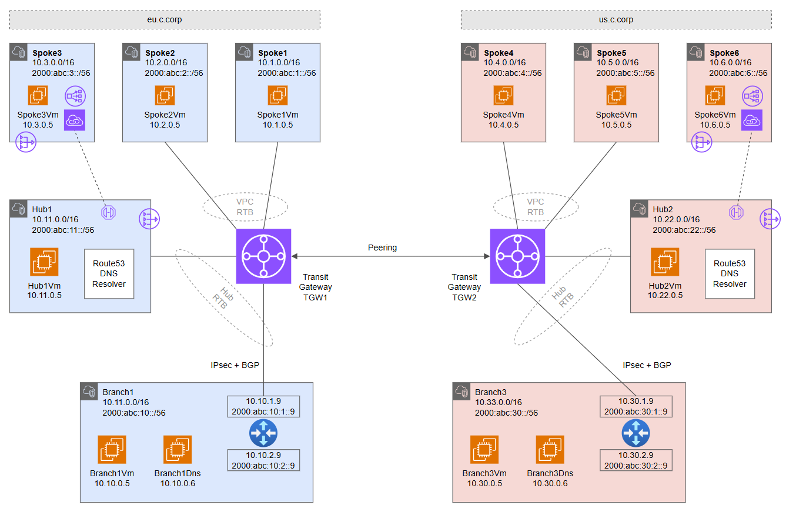

# Transit Gateway Hub and Spoke - Dual Region <!-- omit from toc -->

## Lab: B <!-- omit from toc -->

Contents

- [Overview](#overview)
- [Prerequisites](#prerequisites)
- [Deploy the Lab](#deploy-the-lab)
- [Troubleshooting](#troubleshooting)
- [Outputs](#outputs)
- [Dashboards (Optional)](#dashboards-optional)
- [Testing](#testing)
  - [1. Ping IP](#1-ping-ip)
  - [2. Curl DNS](#2-curl-dns)
  - [3. Private Link Service](#3-private-link-service)
  - [4. On-premises Routes](#4-on-premises-routes)
- [Cleanup](#cleanup)
- [Requirements](#requirements)
- [Inputs](#inputs)
- [Outputs](#outputs-1)


## Overview

This lab deploys a dual-region transit gateway hub and spoke topology. The lab demonstrates multi-region traffic routing patterns, [hybrid DNS](https://docs.aws.amazon.com/prescriptive-guidance/latest/patterns/set-up-dns-resolution-for-hybrid-networks-in-a-single-account-aws-environment.html) resolution, and [PrivateLink](https://docs.aws.amazon.com/vpc/latest/userguide/endpoint-services-overview.html) access to IaaS and PaaS services.


<p>

The Virtual Private Cloud (VPC) networks, ***hub1*** and ***hub2***, are central hub networks that host shared services for all spokes in a region. Shared services include private DNS, firewall, tooling and other resources. ***hub1*** and ***hub2*** connect to their respective transit gateways, ***tgw1*** and ***tgw2***.

***Spoke1*** and ***spoke2*** connect to ***tgw1*** using [transit gateway VPC attachments](https://docs.aws.amazon.com/vpc/latest/tgw/tgw-vpc-attachments.html). Similarly, ***Spoke4*** and ***spoke5*** connect to ***tgw2*** using attachments. ***Spoke3*** and ***spoke6*** are not connected to the transit gateways but are reachable via [PrivateLink endpoints](https://docs.aws.amazon.com/vpc/latest/privatelink/concepts.html#concepts-vpc-endpoints) in the hubs.


***Branch1*** and ***branch3*** are on-premises networks simulated using VPCs. Multi-NIC Linux NVA appliances connect to the transit gateways using IPsec VPN connections with dynamic (BGP) routing. The branches connect to each other via inter-regional transit gateway peering.

## Prerequisites

Ensure you meet all requirements in the [prerequisites](../../prerequisites/README.md) before proceeding.

## Deploy the Lab

1. Clone the Git Repository for the Labs

   ```sh
   git clone https://github.com/kaysalawu/aws-network-terraform.git
   ```

2. Navigate to the lab directory

   ```sh
   cd aws-network-terraform/3-labs/b-dual-region
   ```
3. (Optional) If you want to enable additional features such as IPv6, VPC flow logs and logging set the following variables to `true` in the [`02-main.tf`](./02-main.tf) file.

   | Variable          | Description                                | Default | Link                               |
   | ----------------- | ------------------------------------------ | ------- | ---------------------------------- |
   | enable_dashboards | Configure dashboards for enabled resources | false   | [02-main.tf#L09](./02-main.tf#L09) |
   | enable_ipv6       | Enable IPv6 on all supported resources     | false   | [02-main.tf#L10](./02-main.tf#L10) |
   | enable_flow_logs  | Enable VPC flow logs in the VPC hubs       | false   | [02-main.tf#L11](./02-main.tf#L11) |
   |                   |                                            |         |
4. Run the following terraform commands and type ***yes*** at the prompt:

   ```sh
   terraform init
   terraform plan
   terraform apply -parallelism=50
   ```

## Troubleshooting

See the [troubleshooting](../../troubleshooting/README.md) section for tips on how to resolve common issues that may occur during the deployment of the lab.

## Outputs

The table below shows the auto-generated output files from the lab. They are located in the `output` directory.

| Item               | Description                           | Location                                                     |
| ------------------ | ------------------------------------- | ------------------------------------------------------------ |
| Branch1 DNS        | Authoritative DNS and forwarding      | [_output/branch1-dns.sh](./_output/branch1-dns.sh)           |
| Branch3 DNS        | Authoritative DNS and forwarding      | [_output/branch3-dns.sh](./_output/branch3-dns.sh)           |
| Branch1 NVA        | Linux Strongswan + FRR configuration  | [_output/branch1-nva.sh](./_output/branch1-nva.sh)           |
| Branch3 NVA        | Linux Strongswan + FRR configuration  | [_output/branch3-nva.sh](./_output/branch3-nva.sh)           |
| VM server          | Python Flask web server, test scripts | [_output/server.sh](./_output/server.sh)                     |
| VM cloud-init YAML | Python Flask web server, test scripts | [_output/vm-cloud-config.yml](./_output/vm-cloud-config.yml) |
|                    |                                       |                                                              |

## Dashboards (Optional)

This lab contains a number of pre-configured dashboards for monitoring gateways, VPN gateways, firewall and other resources. To deploy the dashboards, set `enable_dashboards = true` in the [02-main.tf#L09](./02-main.tf#L09) file. Then run `terraform apply` to update the deployment.

<details>

<summary>Sample Dashboards</summary>

To view the dashboards, follow the steps below:

1. From the AWS console menu, select....

2. TBC.

3. TBC.

4. TBC.

Sample dashboard for transit gateway ***tgw1***.


</details>
<p>

## Testing

Each EC2 instance is pre-configured with a shell [startup script](../../scripts/startup.sh) to run various types of network reachability tests.

You can [enable serial console access](https://docs.aws.amazon.com/AWSEC2/latest/UserGuide/configure-access-to-serial-console.html#serial-console-account-access) for all regions in order to connect to EC2 instances via the serial console. Alternatively, you can set up SSH key-pair access to the EC2 instances as described in the [prerequisites](../../prerequisites/README.md#6-ssh-access-to-virtual-machines-optional).

- Login to EC2 instance `b-spoke1-vm` via the [serial console](https://docs.aws.amazon.com/AWSEC2/latest/UserGuide/connect-to-serial-console.html)
- Enter the login credentials
  - username = ***ubuntu***
  - password = ***Password123***
- You should now be in a shell session `b-spoke1-vm:~$`

</details>
<p>

Run the following tests from inside the serial console session.

### 1. Ping IP

This script pings the IP addresses of some test EC2 instances and reports reachability and round trip time.

**1.1.** Run the IP ping tests

```sh
ping-ipv4
```

<details>

<summary>Sample output</summary>

```sh
b-spoke1-vm:~$ ping-ipv4

 ping ipv4 ...

branch1 - 10.10.0.5 - OK 1.236 ms
hub1  - 10.11.0.5 - OK 0.599 ms
spoke1  - 10.1.0.5 - OK 0.041 ms
spoke2  - 10.2.0.5 - OK 0.941 ms
branch3 - 10.30.0.5 - OK 80.243 ms
hub2  - 10.22.0.5 - OK 79.917 ms
spoke4  - 10.4.0.5 - OK 79.662 ms
spoke5  - 10.5.0.5 - OK 80.102 ms
```

</details>
<p>

### 2. Curl DNS

This script uses curl to check reachability of web server (python Flask) on the test EC2 instances. It reports HTTP response message, round trip time and IP address.

**2.1.** Run a DNS curl test

```sh
curl-dns4
```

<details>

<summary>Sample output</summary>

```sh
b-spoke1-vm:~$ curl-dns4

 curl dns ipv4 ...

200 (0.091001s) - 10.10.0.5 - branch1Vm.corp
200 (0.008814s) - 10.11.0.5 - hub1Vm.eu.aws.corp
200 (1.507219s) - 10.11.20.83 - spoke3pls.eu.aws.corp
200 (0.006951s) - 10.1.0.5 - spoke1Vm.eu.aws.corp
200 (0.005283s) - 10.2.0.5 - spoke2Vm.eu.aws.corp
200 (0.167859s) - 10.30.0.5 - branch3Vm.corp
200 (0.170303s) - 10.22.0.5 - hub2Vm.us.aws.corp
200 (1.667676s) - 10.22.20.64 - spoke6pls.us.aws.corp
200 (0.165986s) - 10.4.0.5 - spoke4Vm.us.aws.corp
200 (0.164345s) - 10.5.0.5 - spoke5Vm.us.aws.corp
200 (0.018742s) - 104.16.184.241 - icanhazip.com
```

</details>
<p>

### 3. Private Link Service

**3.1.** Test access to ***spoke3*** web application using the private endpoint in ***hub1***.

```sh
curl spoke3pls.eu.aws.corp
```

<details>

<summary>Sample output</summary>

```json
b-spoke1-vm:~$ curl spoke3pls.eu.aws.corp
{
  "app": "SERVER",
  "hostname": "b-spoke3-vm",
  "c-hostname": "-DCK-http-80",
  "ipv4": "10.3.0.5",
  "ipv6": "NotFound",
  "remote-addr": "10.3.18.99",
  "headers": {
    "host": "spoke3pls.eu.aws.corp",
    "user-agent": "curl/7.68.0",
    "accept": "*/*"
  }
}
```

</details>
<p>

**3.2.** Test access to ***spoke6*** web application using the private endpoint in ***hub2***.

```sh
curl spoke6pls.us.aws.corp
```

<details>

<summary>Sample output</summary>

```sh
b-spoke1-vm:~$ curl spoke6pls.us.aws.corp
{
  "app": "SERVER",
  "hostname": "b-spoke6-vm",
  "c-hostname": "-DCK-http-80",
  "ipv4": "10.6.0.5",
  "ipv6": "NotFound",
  "remote-addr": "10.6.18.99",
  "headers": {
    "host": "spoke6pls.us.aws.corp",
    "user-agent": "curl/7.68.0",
    "accept": "*/*"
  }
}
```

</details>
<p>

The `Hostname`, `server-ipv4` and `server-ipv6` fields identify the actual web servers - in this case ***spoke3*** and ***spoke6*** EC2 instances. The `remote-addr` fields (as seen by the web servers) are IP addresses in the Private Link Service NAT subnets in ***spoke3*** and ***spoke6*** respectively.

### 4. On-premises Routes

**4.1** Login to on-premises EC2 instance `a-branch1-nva` via the [serial console](https://docs.aws.amazon.com/AWSEC2/latest/UserGuide/connect-to-serial-console.html):
  - username = ***ubuntu***
  - password = ***Password123***

**4.2.** Enter the VTY shell for the FRRouting daemon.

```sh
sudo vtysh
```

<details>

<summary>Sample output</summary>

```sh
b-branch1-nva:~$ sudo vtysh

Hello, this is FRRouting (version 7.2.1).
Copyright 1996-2005 Kunihiro Ishiguro, et al.
```

</details>
<p>

**4.3.** Display the routing table by typing `show ip route` and pressing the space bar to show the complete output.

```sh
show ip route
```

<details>

<summary>Sample output</summary>

```sh
b-branch1-nva# show ip route
Codes: K - kernel route, C - connected, S - static, R - RIP,
       O - OSPF, I - IS-IS, B - BGP, E - EIGRP, N - NHRP,
       T - Table, v - VNC, V - VNC-Direct, A - Babel, D - SHARP,
       F - PBR, f - OpenFabric,
       > - selected route, * - FIB route, q - queued route, r - rejected route

S   0.0.0.0/0 [1/0] via 10.10.2.1 (recursive), 02:21:52
                      via 10.10.2.1, ens5 onlink, 02:21:52
K * 0.0.0.0/0 [0/200] via 10.10.4.1, ens6, src 10.10.4.9, 02:21:52
K>* 0.0.0.0/0 [0/100] via 10.10.2.1, ens5, src 10.10.2.9, 02:21:52
B>* 10.1.0.0/16 [20/100] via 169.254.11.133, tun2, 00:10:29
  *                      via 169.254.15.141, tun1, 00:10:29
B>* 10.2.0.0/16 [20/100] via 169.254.11.133, tun2, 00:10:29
  *                      via 169.254.15.141, tun1, 00:10:29
B>* 10.4.0.0/16 [20/100] via 169.254.11.133, tun2, 00:10:29
  *                      via 169.254.15.141, tun1, 00:10:29
B>* 10.5.0.0/16 [20/100] via 169.254.11.133, tun2, 00:10:29
  *                      via 169.254.15.141, tun1, 00:10:29
S>  10.10.0.0/24 [1/0] via 10.10.2.1 (recursive), 02:21:52
  *                      via 10.10.2.1, ens5 onlink, 02:21:52
C>* 10.10.2.0/24 [0/100] is directly connected, ens5, 02:21:52
K>* 10.10.2.1/32 [0/100] is directly connected, ens5, 02:21:52
C>* 10.10.4.0/24 [0/200] is directly connected, ens6, 02:21:52
K>* 10.10.4.1/32 [0/200] is directly connected, ens6, 02:21:52
B>* 10.11.0.0/16 [20/100] via 169.254.11.133, tun2, 00:10:29
  *                       via 169.254.15.141, tun1, 00:10:29
B>* 10.22.0.0/16 [20/100] via 169.254.11.133, tun2, 00:10:29
  *                       via 169.254.15.141, tun1, 00:10:29
B>* 10.30.0.0/16 [20/100] via 169.254.11.133, tun2, 00:10:29
  *                       via 169.254.15.141, tun1, 00:10:29
C>* 169.254.11.133/32 is directly connected, tun2, 00:10:37
S>* 169.254.11.134/32 [1/0] is directly connected, tun2, 00:10:37
C>* 169.254.15.141/32 is directly connected, tun1, 00:10:35
S>* 169.254.15.142/32 [1/0] is directly connected, tun1, 00:10:35
C>* 192.168.10.10/32 is directly connected, lo, 02:21:52
```

We can see the VPC ranges learned dynamically via BGP.

</details>
<p>

**4.4.** Display BGP information by typing `show ip bgp` and pressing the space bar to show the complete output.

```sh
show ip bgp
```

<details>

<summary>Sample output</summary>

```sh
b-branch1-nva# show ip bgp
BGP table version is 239, local router ID is 192.168.10.10, vrf id 0
Default local pref 100, local AS 65001
Status codes:  s suppressed, d damped, h history, * valid, > best, = multipath,
               i internal, r RIB-failure, S Stale, R Removed
Nexthop codes: @NNN nexthop's vrf id, < announce-nh-self
Origin codes:  i - IGP, e - EGP, ? - incomplete

   Network          Next Hop            Metric LocPrf Weight Path
*= 10.1.0.0/16      169.254.11.133         100             0 65011 i
*>                  169.254.15.141         100             0 65011 i
*= 10.2.0.0/16      169.254.11.133         100             0 65011 i
*>                  169.254.15.141         100             0 65011 i
*= 10.4.0.0/16      169.254.11.133         100             0 65011 i
*>                  169.254.15.141         100             0 65011 i
*= 10.5.0.0/16      169.254.11.133         100             0 65011 i
*>                  169.254.15.141         100             0 65011 i
*> 10.10.0.0/24     0.0.0.0                  0         32768 i
*= 10.11.0.0/16     169.254.11.133         100             0 65011 i
*>                  169.254.15.141         100             0 65011 i
*= 10.22.0.0/16     169.254.11.133         100             0 65011 i
*>                  169.254.15.141         100             0 65011 i
*= 10.30.0.0/16     169.254.11.133         100             0 65011 i
*>                  169.254.15.141         100             0 65011 i

Displayed  8 routes and 15 total paths
```

We can see the hub and spoke VPC ranges being learned dynamically in the BGP table.

</details>
<p>

**4.5.** Exit the vtysh shell by typing `exit` and pressing `Enter`.

```sh
exit
```

## Cleanup

1. (Optional) Navigate back to the lab directory (if you are not already there)

   ```sh
   cd aws-network-terraform/3-labs/b-dual-region
   ```

2. Run the following command and type ***yes*** at the prompt:

   ```sh
   terraform destroy
   ```

<!-- BEGIN_TF_DOCS -->
## Requirements

No requirements.

## Inputs

| Name                                                                                                    | Description                    | Type     | Default | Required |
| ------------------------------------------------------------------------------------------------------- | ------------------------------ | -------- | ------- | :------: |
| <a name="input_aws_access_key"></a> [aws\_access\_key](#input\_aws\_access\_key)                        | account access key             | `any`    | n/a     |   yes    |
| <a name="input_aws_secret_access_key"></a> [aws\_secret\_access\_key](#input\_aws\_secret\_access\_key) | account secret key             | `any`    | n/a     |   yes    |
| <a name="input_prefix"></a> [prefix](#input\_prefix)                                                    | prefix used for all resources  | `string` | `"b"`   |    no    |
| <a name="input_public_key_path"></a> [public\_key\_path](#input\_public\_key\_path)                     | path to public key for ec2 SSH | `any`    | n/a     |   yes    |

## Outputs

| Name                                                                                        | Description |
| ------------------------------------------------------------------------------------------- | ----------- |
| <a name="output_bastion_public_ip"></a> [bastion\_public\_ip](#output\_bastion\_public\_ip) | n/a         |
<!-- END_TF_DOCS -->
