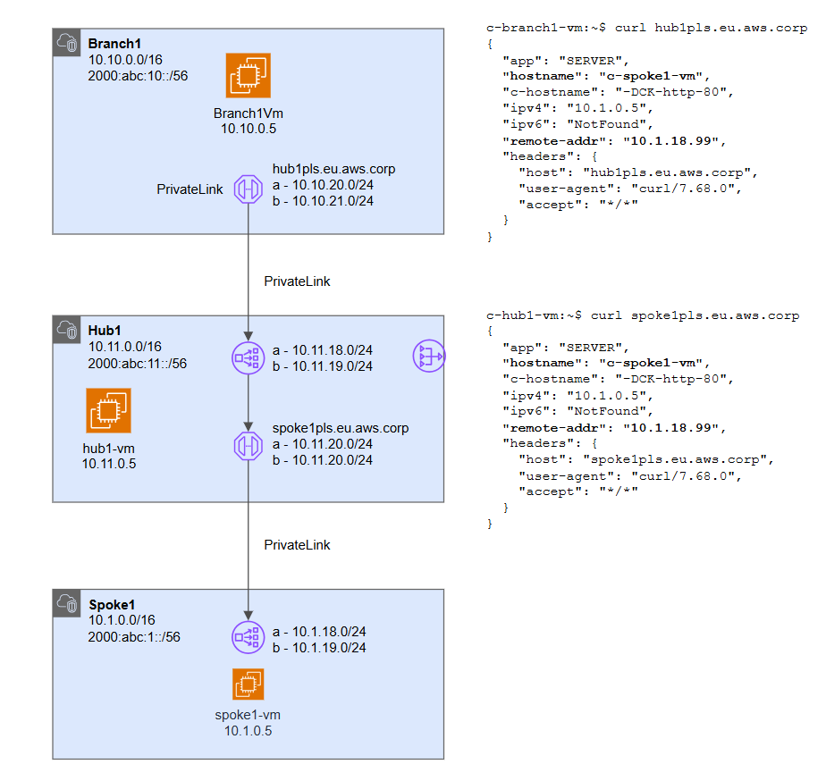

# PrivateLink Chaining <!-- omit from toc -->

## Lab: C <!-- omit from toc -->

Contents

- [Overview](#overview)
- [Prerequisites](#prerequisites)
- [Deploy the Lab](#deploy-the-lab)
- [Troubleshooting](#troubleshooting)
- [Outputs](#outputs)
- [Testing Private Link Service from ***c-branch1-vm***](#testing-private-link-service-from-c-branch1-vm)
- [Cleanup](#cleanup)
- [Requirements](#requirements)
- [Inputs](#inputs)
- [Outputs](#outputs-1)


## Overview

This lab deploys a single region architecture to demonstrate daisy-chaining of AWS PrivateLink services.


<p>

An endpoint in the source VPC, `c-branch1-vpc`, is connected to a Private Link Service in the hub VPC, `c-hub1-vpc`. The Private Link Service in `Hub1` is linked to a network load balancer with a IP endpoint (backend) that connects to another PrivateLink Service in the destination VPC, `c-spoke1-vpc`.

## Prerequisites

Ensure you meet all requirements in the [prerequisites](../../prerequisites/README.md) before proceeding.

## Deploy the Lab

1. Clone the Git Repository for the Labs

   ```sh
   git clone https://github.com/kaysalawu/aws-network-terraform.git
   ```

2. Navigate to the lab directory

   ```sh
   cd aws-network-terraform/3-labs/c-privatelink-chain
   ```

3. Run the following terraform commands and type ***yes*** at the prompt:

   ```sh
   terraform init
   terraform plan
   terraform apply -parallelism=50
   ```

## Troubleshooting

See the [troubleshooting](../../troubleshooting/README.md) section for tips on how to resolve common issues that may occur during the deployment of the lab.

## Outputs

The table below shows the auto-generated output files from the lab. They are located in the `output` directory.

| Item    | Description  | Location |
|--------|--------|--------|
| VM server | Python Flask web server, test scripts | [_output/server.sh](./_output/server.sh) |
| VM cloud-init YAML | Python Flask web server, test scripts | [_output/vm-cloud-config.yml](./_output/vm-cloud-config.yml) |
||||

## Testing Private Link Service from ***c-branch1-vm***

Each EC2 instance is pre-configured with a shell [startup script](../../scripts/startup.sh) to run various types of network reachability tests.

You can [enable serial console access](https://docs.aws.amazon.com/AWSEC2/latest/UserGuide/configure-access-to-serial-console.html#serial-console-account-access) for all regions in order to connect to EC2 instances via the serial console. Alternatively, you can set up SSH key-pair access to the EC2 instances as described in the [prerequisites](../../prerequisites/README.md#6-ssh-access-to-virtual-machines-optional).

- Login to EC2 instance `c-branch1-vm` via the [serial console](https://docs.aws.amazon.com/AWSEC2/latest/UserGuide/connect-to-serial-console.html)
- Enter the login credentials
  - username = ***ubuntu***
  - password = ***Password123***
- You should now be in a shell session `c-branch1-vm:~$`

</details>
<p>

Run curl from inside the serial console session to access the Private Link Service in the hub VPC, `c-hub1-vpc`.

```sh
curl hub1pls.eu.c.corp
```

Sample output:

```sh
c-branch1-vm:~$ curl hub1pls.eu.aws.corp
{
  "app": "SERVER",
  "hostname": "c-spoke1-vm",
  "c-hostname": "-DCK-http-80",
  "ipv4": "10.1.0.5",
  "ipv6": "NotFound",
  "remote-addr": "10.1.18.99",
  "headers": {
    "host": "hub1pls.eu.aws.corp",
    "user-agent": "curl/7.68.0",
    "accept": "*/*"
  }
}
```

The output shows we are connected to the VM, `c-spoke1-vm`, via the two Private Link Services.

## Cleanup

1\. (Optional) Navigate back to the lab directory (if you are not already there)

```sh
cd aws-network-terraform/3-labs/c-privatelink-chain
```

2\. Run the following command and type ***yes*** at the prompt:

```sh
terraform destroy
```

<!-- BEGIN_TF_DOCS -->
## Requirements

No requirements.

## Inputs

| Name | Description | Type | Default | Required |
|------|-------------|------|---------|:--------:|
| <a name="input_aws_access_key"></a> [aws\_access\_key](#input\_aws\_access\_key) | account access key | `any` | n/a | yes |
| <a name="input_aws_secret_access_key"></a> [aws\_secret\_access\_key](#input\_aws\_secret\_access\_key) | account secret key | `any` | n/a | yes |
| <a name="input_prefix"></a> [prefix](#input\_prefix) | prefix used for all resources | `string` | `"c"` | no |
| <a name="input_public_key_path"></a> [public\_key\_path](#input\_public\_key\_path) | path to public key for ec2 SSH | `any` | `null` | no |

## Outputs

| Name | Description |
|------|-------------|
| <a name="output_bastion_public_ip"></a> [bastion\_public\_ip](#output\_bastion\_public\_ip) | n/a |
<!-- END_TF_DOCS -->
