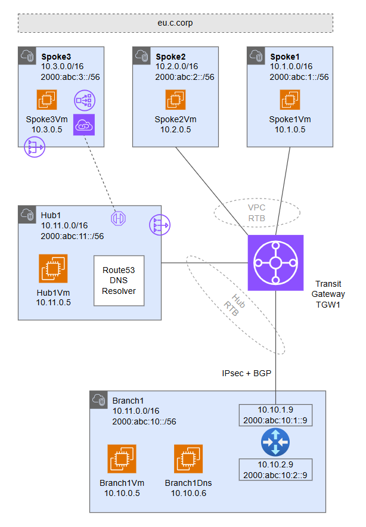

# AWS Network Architecture - Terraform Examples <!-- omit from toc -->

This repository contains Terraform code examples for deploying AWS network architectures for testing and learning purposes.

## [A. Transit Gateway Hub and Spoke - Single Region](./3-labs/a-single-region/README.md)

⚙️ [**Deploy Terraform Code**](./3-labs/a-single-region/README.md)

This lab deploys a single-region transit gateway hub and spoke topology. The lab demonstrates traffic routing patterns, [hybrid DNS](https://docs.aws.amazon.com/prescriptive-guidance/latest/patterns/set-up-dns-resolution-for-hybrid-networks-in-a-single-account-aws-environment.html) resolution, and [PrivateLink](https://docs.aws.amazon.com/vpc/latest/userguide/endpoint-services-overview.html) access to IaaS and PaaS services.

The Virtual Private Cloud (VPC) network, ***hub1*** is a central hub network that hosts shared services for all spokes in the region. Shared services include private DNS, firewall, tooling and other resources. ***hub1***  connects to a transit gateway, ***tgw1*** which provides transit connectivity for on-premises and cross-region traffic.

***Spoke1*** and ***spoke2*** connect to ***tgw1*** using [transit gateway VPC attachments](https://docs.aws.amazon.com/vpc/latest/tgw/tgw-vpc-attachments.html). ***Spoke3*** is not connected to the transit gateway but is reachable via a [PrivateLink endpoint](https://docs.aws.amazon.com/vpc/latest/privatelink/concepts.html#concepts-vpc-endpoints) in the hub.

***Branch1*** is an on-premises network simulated using a VPC. A multi-NIC Linux NVA appliance connects to the transit gateway using IPsec VPN connections with dynamic (BGP) routing. The branches connect to each other via inter-regional transit gateway peering.

## [B. Transit Gateway Hub and Spoke - Dual Region ](./3-labs/b-dual-region/README.md)

⚙️ [**Deploy Terraform Code**](./3-labs/b-dual-region/README.md)

This lab deploys a dual-region transit gateway hub and spoke topology. The lab demonstrates multi-region traffic routing patterns, [hybrid DNS](https://docs.aws.amazon.com/prescriptive-guidance/latest/patterns/set-up-dns-resolution-for-hybrid-networks-in-a-single-account-aws-environment.html) resolution, and [PrivateLink](https://docs.aws.amazon.com/vpc/latest/userguide/endpoint-services-overview.html) access to IaaS and PaaS services.

The Virtual Private Cloud (VPC) networks, ***hub1*** and ***hub2***, are central hub networks that host shared services for all spokes in a region. Shared services include private DNS, firewall, tooling and other resources. ***hub1*** and ***hub2*** connect to their respective transit gateways, ***tgw1*** and ***tgw2***.

***Spoke1*** and ***spoke2*** connect to ***tgw1*** using [transit gateway VPC attachments](https://docs.aws.amazon.com/vpc/latest/tgw/tgw-vpc-attachments.html). Similarly, ***Spoke4*** and ***spoke5*** connect to ***tgw2*** using attachments. ***Spoke3*** and ***spoke6*** are not connected to the transit gateways but are reachable via [PrivateLink endpoints](https://docs.aws.amazon.com/vpc/latest/privatelink/concepts.html#concepts-vpc-endpoints) in the hubs.

***Branch1*** and ***branch3*** are on-premises networks simulated using VPCs. Multi-NIC Linux NVA appliances connect to the transit gateways using IPsec VPN connections with dynamic (BGP) routing. The branches connect to each other via inter-regional transit gateway peering.

## [C. PrivateLink Chaining ](./3-labs/c-privatelink-chain/README.md)

⚙️ [**Deploy Terraform Code**](./3-labs/c-privatelink-chain/README.md)

This lab deploys a single region architecture to demonstrate daisy-chaining of AWS PrivateLink services.

An endpoint in the source VPC, `c-branch1-vpc`, is connected to a Private Link Service in the hub VPC, `c-hub1-vpc`. The Private Link Service in `Hub1` is linked to a network load balancer with a IP endpoint (backend) that connects to another PrivateLink Service in the destination VPC, `c-spoke1-vpc`.
